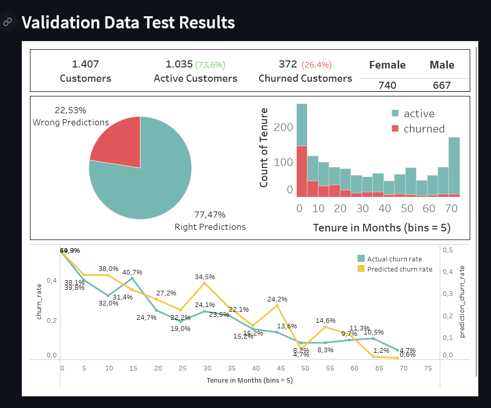

# End to End Customer Churn Project.


- This project aims to train and deploy a machine learning model for classifying customer churns.
- It goes since data collection to deploying model into production.
- Optimized Random Forest, XGBoost, Logistic Regression, Naive Bayes and KNN using GridsearchCV to reach the best model.
- Built a client facing API using streamlit.
- You can try with new data [HERE](https://hugomilesi-e2e-customer-churn-analysis-st-iguvbo.streamlit.app)

# Resources Used
**Python Version:** 3.10<br>
**Packages:** Streamlit, Sklearn, matplotlib, seaborn, pickle<br>
**For Web Framework Requirements:** ```pip install -r requirements.txt```<br>
**Run** ```streamlit run st.py ```<br>

# Data Cleaning
- Removed NaN rows.
- Renamed row and column values for better understanding.
- Transformed some variables to the right format.

# EDA
### Some highlights from the tables
- I built a chart using tenure(monthly) column to check the distribution types between churns.
- Calculate the churn ratio and made a pie chart.
- Made some bar charts containing to show the distribution between categories.

<div style="display: flex;">
  
  
</div>


# Model Building
1. Transformed categorical into dummy variables, scaled(0, 1) numerical variables.
2. Churn and non-churn customer was unbalanced, so i applied the SMOTE(Synthetic Minority Oversampling Technique) technique.
3. Split the data into train and test set with a test size of 20%.
4. I tried five different models:
      - **K Nearest Neighbors**
      - **Random Forests**
      - **XGBoosting**
      - **Logistic Regression**
      - **Naive Bayes**
    

# Model Benchmarking
The Logistic Regression model outperformed the other approaches on the test and validation sets.

<div style="display: flex;">
  
  

</div>
<div style = "display: flex;">
  
  
</div>

**Cross Validation Results(accuracy):** 
- Logistic Regression    82.8%
- XG Boost               81.3%
- Random Forests         80.8%
- KNN                    77.7%
- Naive Bayes            75.7%

# Productionization
- I built a website hosted at Streamlit where you can insert new data and check the model results.
- Created a 'Randomize' button to insert random data.
- After you click "Make Prediction" button, the model will try to predict how close the customer is close to churn.  
- In 'Model Details' tab contains a chart showing the most important features to make decision. 
- You can check the website version by clicking [This link](https://hugomilesi-e2e-customer-churn-analysis-st-iguvbo.streamlit.app) and insert new data.


