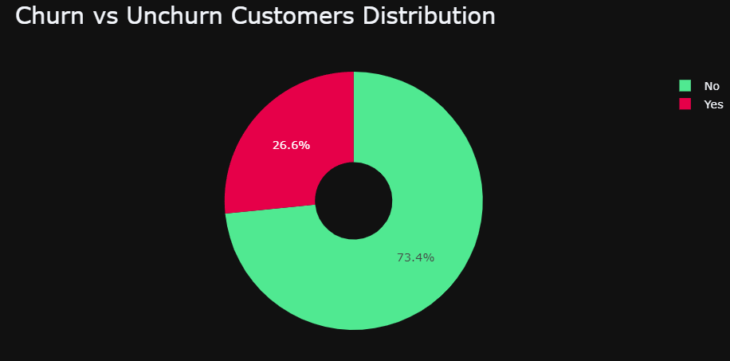
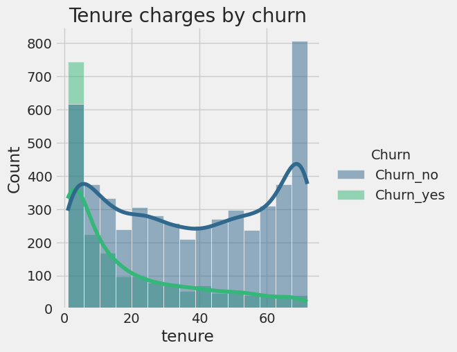
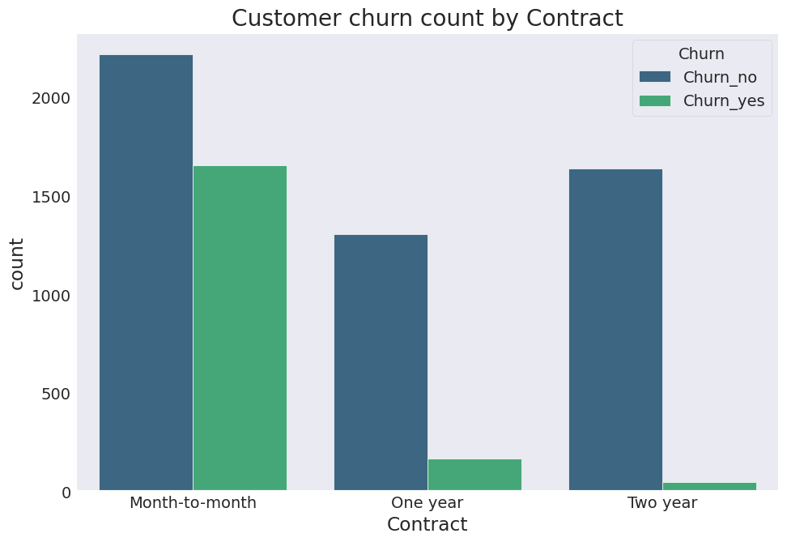
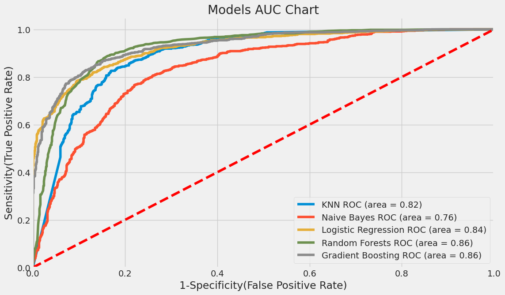

# E2E_customer_churn_analysis
- This project aims to train and deploy a machine learning model for classifying customer churns.
- It goes since data collection to deploying model into production.
- Optimized Random Forest, XGBoost, Logistic Regression, Naive Bayes and KNN using GridsearchCV to reach the best model.
- Built a client facing API using streamlit.

# Resources Used
**Python Version:** 3.10<br>
**Packages:** Streamlit, Sklearn, matplotlib, seaborn, pickle<br>
**For Web Framework Requirements:** ```pip install -r requirements.txt```<br>
**Run** ```streamlit run st.py ```<br>

# Data Cleaning
- Removed NaN rows.
- Renamed row and column values for better understanding.
- Transformed some variables to the right format.

# EDA
### Some hightlights from the tables
- I built a chart using tenure(monthly) column to check the distribution types between churns.
- Calculate the churn ratio and made a pie chart.
- Made some bar charts containing to show the distribution between categories.

<div style="display: flex;">
  
  
</div>


# Model Building
1. Transformed categorical into dummy variables, scaled(0, 1) numerical variables.
2. Churn and non-churn customer was unbalanced, so i applied the SMOTE(Synthetic Minority Oversampling Technique) technique.
3. Split the data into train and test set with a test size of 20%.
4. I tried three different models:
    
<div style="display: flex;">
  
  
</div>


# Model Performance
The Random Forest model outperformed the other approaches on the test and validation sets.
- **Random Forest AUC:**  = 0.86
- **Gradient Boosting AUC:** 0.85
- **Logistic Regression AUC:** 0.84
- **KNN AUC:** 0.82
- **Naive Bayes AUC:** 0.76 

# Productionization
- I built a UI hosted at Streamlit where you can insert new data see the model results.
- Created a 'Randomize' button to insert random data.
- The After you click "Make Prediction" will tell if the customer is close to churn and its propensity to churn.  
- In the 'Model Details' field contains a chart showing the most important features to make decision. 
- You can check the website version by clicking [This link](https://hugomilesi-e2e-customer-churn-analysis-st-iguvbo.streamlit.app) and insert new data.


