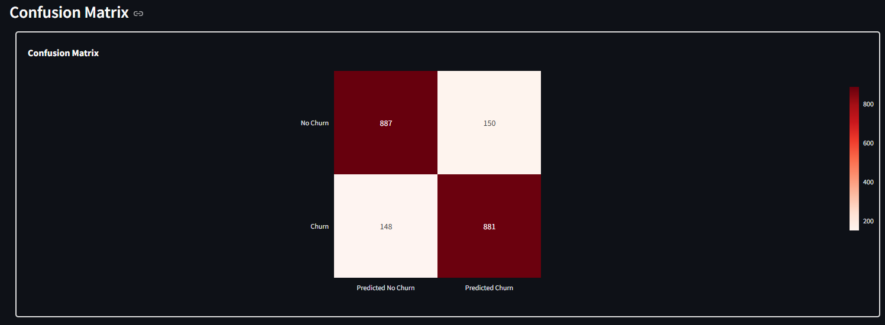
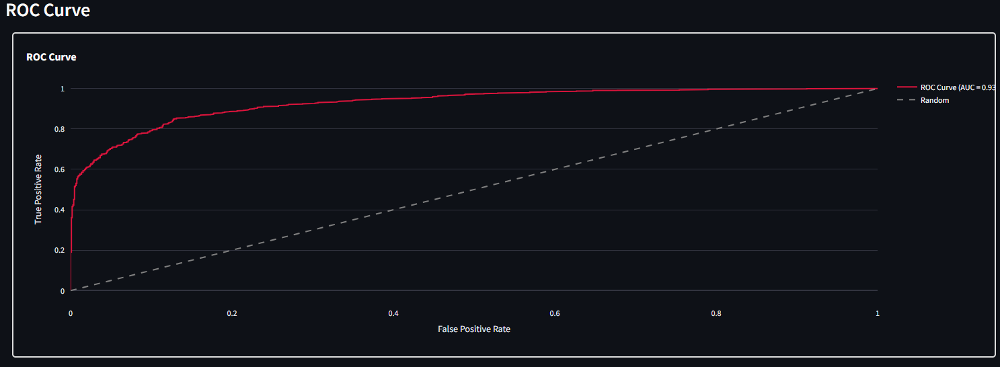

# End to End Customer Churn Project.


- This project aims to train and deploy a machine learning model for classifying customer churns.
- It goes since data collection to deploying model into production.
- Optimized Random Forest, XGBoost, Logistic Regression, Naive Bayes and KNN using GridsearchCV to reach the best model.
- Built a client facing API using streamlit.
- You can try with new data [HERE](https://hugomilesi-e2e-customer-churn-analysis-st-iguvbo.streamlit.app)

# Resources Used
**Python Version:** 3.10<br>
**Packages:** Streamlit, Sklearn, matplotlib, seaborn, pickle<br>
**For Web Framework Requirements:** ```pip install -r requirements.txt```<br>
**Run** ```streamlit run st.py ```<br>

# Data Cleaning
- Removed NaN rows.
- Renamed row and column values for better understanding.
- Transformed some variables to the right format.

# EDA
### Some highlights from the tables
- I built a chart using tenure(monthly) column to check the distribution types between churns.
- Calculate the churn ratio and made a pie chart.
- Made some bar charts containing to show the distribution between categories.

<div style="display: flex;">
  
  
</div>

<div style="display: flex;">
</div>


# Model Building
1. Transformed categorical into dummy variables, scaled(0, 1) numerical variables.
2. Churn and non-churn customer was unbalanced, so i applied the SMOTE(Synthetic Minority Oversampling Technique) technique.
3. Split the data into train and test set with a test size of 20%.
4. I tried five different models:
      - **K Nearest Neighbors**
      - **Random Forests**
      - **XGBoosting**
      - **Logistic Regression**
      - **Naive Bayes**
    
# Model Benchmarking
<div style="display: flex;">
  
</div>

<div style="display: flex; justify-content: center; gap: 20px;">
  
  
</div>

**Cross Validation Results(accuracy):** 
- Logistic Regression    82.7%
- XG Boost               81.8%
- Random Forests         81.2%
- KNN                    76.7%
- Naive Bayes            75.9%

## Selected Model: Logistic Regression

After careful evaluation of the performance metrics for Random Forests, K-Nearest Neighbors (KNN), Naive Bayes, Logistic Regression, and XGBoost, I have decided to choose the **Logistic Regression** model for the customer churn prediction task. The decision is based on the following reasons, which align with the goal of maximizing predictive performance while ensuring practical deployment and business impact:

1. **Highest Accuracy and Robustness**:
   Logistic Regression achieved the highest K-Fold cross-validation accuracy of **0.832026**, surpassing XGBoost (0.806870), Random Forests (0.804928), KNN (0.762336), and Naive Bayes (0.754107). Its validation set accuracy of **0.83203 ± 0.0199** is also the highest, indicating strong and consistent performance on unseen data. High accuracy is critical for reliable churn predictions, ensuring the company can trust the model’s outputs for retention strategies.

2. **Superior Discrimination (AUC)**:
   The model’s validation AUC of **0.91717 ± 0.0137** is the highest among all models, compared to XGBoost (0.88606), Random Forests (0.87634), KNN, and Naive Bayes. The ROC AUC of **0.84** further supports its strong ability to discriminate between churned and non-churned customers. A high AUC ensures the model effectively identifies at-risk customers, which is essential for targeting retention campaigns.

3. **Balanced False Positives and Negatives**:
   The confusion matrix for Logistic Regression shows **872 true positives (TP)**, **165 false positives (FP)**, **165 false negatives (FN)**, and **864 true negatives (TN)**. Compared to other models:
   - **False Negatives (FN)**: Logistic Regression (165 FN) performs better than Random Forests (136 FN), KNN (135 FN), Naive Bayes (148 FN), and is close to XGBoost (153 FN). Low FN ensures fewer churned customers are missed, maximizing retention opportunities.
   - **False Positives (FP)**: With 165 FP, it outperforms KNN (233 FP) and Naive Bayes (352 FP), and is competitive with XGBoost (164 FP) and Random Forests (174 FP). Low FP prevents wasting resources on non-churners.
   This balance is crucial for optimizing retention campaign costs and effectiveness.

4. **Interpretability and Scalability**:
   Logistic Regression offers inherent interpretability through its coefficients, which directly indicate the impact of each feature on churn probability (as saved in `feat_imp.csv`). This transparency enables the company to understand key churn drivers (e.g., contract length, payment issues) and design targeted interventions. Unlike ensemble methods like XGBoost or Random Forests, Logistic Regression is computationally lightweight and easier to deploy in production, making it scalable for real-time predictions in CRM systems.

5. **Practical Business Alignment**:
   The model’s high accuracy and AUC, combined with its balanced error rates, ensure it delivers actionable predictions for customer retention. By minimizing missed churners (FN) and unnecessary interventions (FP), Logistic Regression maximizes ROI for retention campaigns. Its feature importance insights (from coefficients) further support strategic decisions, such as product or pricing improvements, enhancing long-term customer satisfaction.

### Supporting Metrics
The following metrics informed the decision:

| Model              | K-Fold Accuracy | Validation Accuracy | Validation AUC | ROC AUC | False Negatives | False Positives |
|--------------------|-----------------|---------------------|----------------|---------|-----------------|-----------------|
| Logistic Regression | **0.832026**    | **0.83203 ± 0.0199** | **0.91717 ± 0.0137**   | 0.84     | 165             | 165             |
| XGBoost             | 0.806870        | 0.80687 ± 0.0053     | 0.88606 ± 0.0115       | **0.85** | 153             | 164             |
| Random Forests      | 0.804928        | 0.80493 ± 0.0121     | 0.87634 ± 0.0139       | **0.85** | 136             | 174             |
| KNN                 | 0.762336        | 0.76234 ± 0.0193     | 0.83571 ± 0.0128       | 0.82     | 135             | 233             |
| Naive Bayes         | 0.754107        | 0.75411 ± 0.0155     | 0.83389 ± 0.0198       | 0.76     | 148             | 352             |


# Key Impacts
- **Impact**: The model identifies at-risk customers with 83.2% accuracy, enabling precise targeting of retention efforts.
- **Business Value**: Personalized interventions (e.g., discounts, contract upgrades) reduce churn rates by addressing key drivers like month-to-month contracts. 
- **Improved Customer Retention**: With 1,869 churned customers (26.6% of customers), the model correctly identifies approximately 80% of at-risk customers (1,495 customers, based on 80% recall from confusion matrix: 873 TP out of 1,037 successes). A 20% successful retention campaign could retain 299 customers.
- **Cost Savings**: If acquiring a new customer costs $100 (conservative estimate), retaining 299 customers saves $29,900 in acquisition costs.
- **Operational Efficiency**: Automating predictions for 7043 customers reduces manual analysis time by an estimated 10 hours per week (assuming 1 hour per 700 customers manually reviewed), improving team productivity.


# Productionization
- I built a website hosted at Streamlit where you can insert new data and check the model results.
- Created a 'Randomize' button to insert random data.
- After you click "Make Prediction" button, the model will try to predict how close the customer is close to churn.  
- In 'Model Details' tab contains a chart showing the most important features to make decision. 
- You can check the website version by clicking [This link](https://hugomilesi-e2e-customer-churn-analysis-st-iguvbo.streamlit.app) and insert new data.


